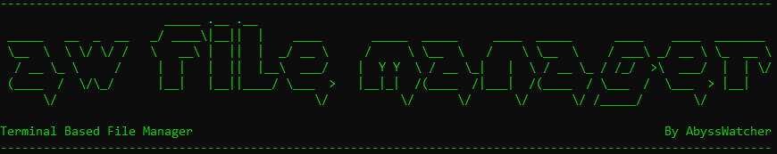

# AWFileManager

AWFileManager is a terminal based file manager developed in C++. Is available in spanish and english. 

It can handle basic operations like:
- List files and directories
- Copy files
- Create and write files
- Add content to a file
- Delete a file

## Instalation

To use AWFileManager you only need to download the version you want and compile it. For that you only need to have a c/c++ compiler. You can use this commands:
- Clone the repository ->
- Go to the directory where the repository has been cloned
- Compile it -> 
- Run it ->
